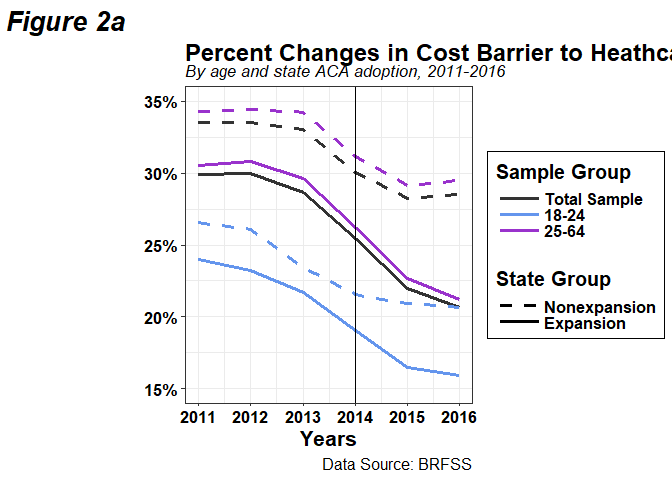
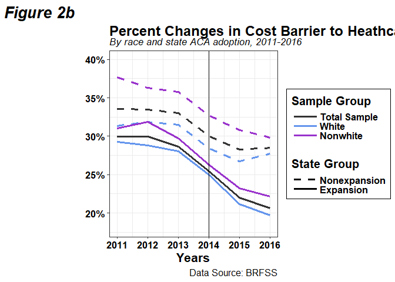

Line graphs
================
Lindsey Dorson

``` r
library(haven)
library(tidyverse)
library(reshape2)
library(ggpubr)
library(cowplot)
library(readxl)

data<- read_excel("data/capstone excel latest.xlsx")
```

``` r
plot1<-ggplot(data = data,aes(Years)) +
  geom_line(aes(y = Expmedmain,color = "Total Sample",linetype = "Exp"),size =1.2) + 
  geom_line(aes(y = NonExpmedmain,color = "Total Sample",linetype = "Non"),size =1.2) +
  geom_line(aes(y = Expmedg1,color = "18-24",linetype = "Exp"),size =1.2) + 
  geom_line(aes(y = NonExpmedg1,color = "18-24",linetype = "Non"),size =1.2) +
  geom_line(aes(y = Expmedg2,color = "25-64",linetype = "Exp"),size =1.2) + 
  geom_line(aes(y = NonExpmedg2,color = "25-64",linetype = "Non"),size =1.2) +
  theme_bw()+
  geom_vline(xintercept = 2014, size =.2) +
  labs(y = "", title = 'Percent Changes in Cost Barrier to Heathcare',subtitle = "By age and state ACA adoption, 2011-2016",caption = "Data Source: BRFSS", tag = "Figure 2a") +
  theme(plot.title = element_text(hjust = 0, face = "bold",size = 18,vjust = -0.75),axis.title.x = element_text(face = "bold",size = 16),
        axis.text.x = element_text(face = "bold",size = 13,color="black"),axis.text.y = element_text(face = "bold",size = 13, color = "black")) +
  scale_y_continuous(limits= c(0.15,0.35),breaks = c(0.15,0.2,0.25,0.3,0.35), labels=c("0.15"="15%","0.2" = "20%","0.25" = "25%","0.3" = "30%","0.35" = "35%")) + 
  scale_colour_manual(name = "Sample Group", values = c(
    "Total Sample"= "#333333", "18-24"="cornflowerblue", "25-64"= "darkorchid"),labels=c("Total Sample", "18-24","25-64")) +
  scale_linetype_manual(name = "State Group",values=c("Non" = "dashed", "Exp"= "solid"), labels = c("Nonexpansion","Expansion")) +
  theme(legend.key.size =  unit(2.5, "lines"),legend.title = element_text(face = "bold", size = 15),legend.position = "right" ,
        legend.box.background = element_rect(size =0.5, color = 'black'),legend.key.height = unit(0, "in"),
        legend.box.margin = margin(1, 1, 1, 1),legend.text = element_text(size =12,face = "bold"),legend.spacing.x = unit(.001, 'cm'),
        plot.tag = element_text(face = "bold.italic",size=20),plot.subtitle = element_text(face = "italic",size =13),plot.caption = element_text(size =12)) 

plot1
```

<!-- -->

``` r
plot2<-ggplot(data = data,aes(Years)) +
  geom_line(aes(y = Expmedmain,color = "Total Sample",linetype = "Exp"),size =1.2) + 
  geom_line(aes(y = NonExpmedmain,color = "Total Sample",linetype = "Non"),size =1.2) +
  geom_line(aes(y = Expwhitemedmain,color = "White",linetype = "Exp"),size =1.2) + 
  geom_line(aes(y = NonExpwhitemedmain,color = "White",linetype = "Non"),size =1.2) +
  geom_line(aes(y = Expnonwhitemedmain,color = "Nonwhite",linetype = "Exp"),size =1.2) + 
  geom_line(aes(y = NonExpnonwhitemedmain,color = "Nonwhite",linetype = "Non"),size =1.2) +
  theme_bw()+
  geom_vline(xintercept = 2014, size =.2) +
  labs(y = "", title = 'Percent Changes in Cost Barrier to Heathcare',subtitle = "By race and state ACA adoption, 2011-2016",caption = "Data Source: BRFSS", tag = "Figure 2b") +
  theme(plot.title = element_text(hjust = 0, face = "bold",size = 18,vjust = -0.75),axis.title.x = element_text(face = "bold",size = 16),
        axis.text.x = element_text(face = "bold",size = 13,color="black"),axis.text.y = element_text(face = "bold",size = 13, color = "black")) +
  scale_y_continuous(limits= c(0.18,0.40),breaks = c(0.2,0.25,0.3,0.35,0.40), labels=c("0.2" = "20%","0.25" = "25%","0.3" = "30%","0.35" = "35%", "0.40"="40%")) + 
  scale_colour_manual(name = "Sample Group", values = c("Total Sample"= "#333333", "White"="cornflowerblue", "Nonwhite"= "darkorchid"),labels=c("Total Sample","White","Nonwhite")) +
  scale_linetype_manual(name = "State Group",values=c("Non" = "dashed", "Exp"= "solid"), labels = c("Nonexpansion","Expansion")) +
  theme(legend.key.size =  unit(2.5, "lines"),legend.title = element_text(face = "bold", size = 15),legend.position = "right" ,
        legend.box.background = element_rect(size =0.5, color = 'black'),legend.key.height = unit(0, "in"),
        legend.box.margin = margin(1, 1, 1, 1),legend.text = element_text(size =12,face = "bold"),legend.spacing.x = unit(.001, 'cm'),
        plot.tag = element_text(face = "bold.italic",size=20),plot.subtitle = element_text(face = "italic",size =13),plot.caption = element_text(size =12)) +
  guides(color = guide_legend(order =1),linetype = guide_legend(order = 2))

plot2
```

<!-- -->
